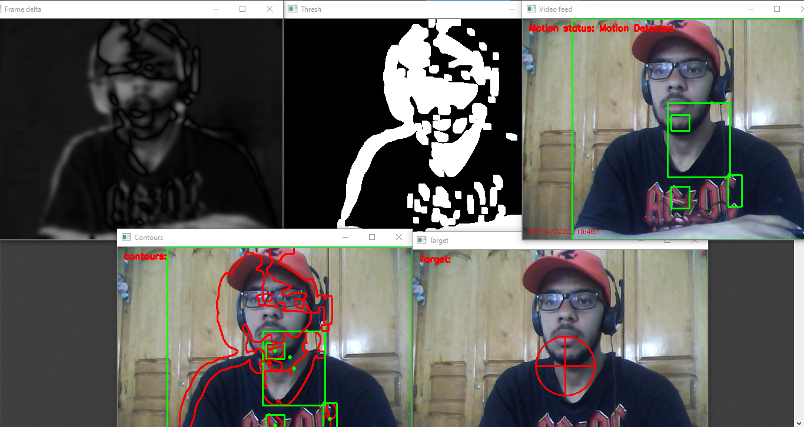

# motion_detection
in this project we aim to detect movements and showcase the steps used in the process frame by frame as well as detecting contours and using the data captured to make a target .

#### Note : this project is a beginner project and it's open for improvements .
